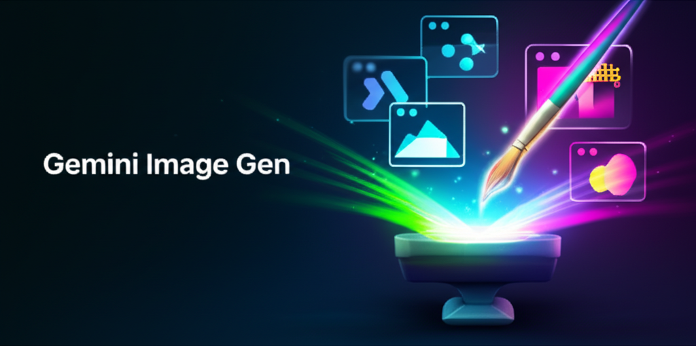
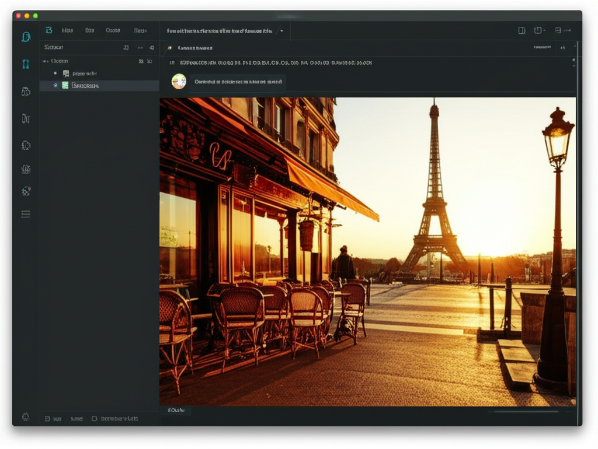
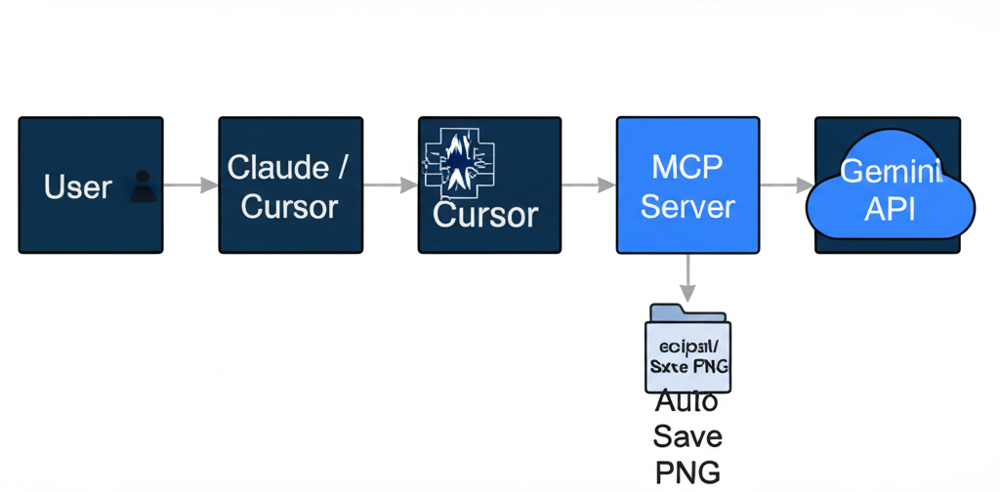

# Gemini Image Gen MCP Server



A lightweight [MCP (Model Context Protocol)](https://modelcontextprotocol.io/) server for AI image generation using Google Gemini. Works with Claude Code, Claude Desktop, Cursor, and any MCP-compatible client.

## Features

- Text-to-image generation powered by Google Gemini
- Multiple model support (Nano Banana 2, experimental, Pro)
- Auto-save generated images to disk
- SOCKS proxy support out of the box
- Simple single-tool interface — just describe what you want

## Demo



## Architecture



```
User Prompt → AI Assistant (Claude / Cursor) → MCP Server → Gemini API
                                                   ↓
                                             Save to disk + Display
```

## Quick Start

### 1. Get a Gemini API Key

Go to [Google AI Studio](https://aistudio.google.com/apikey) and create an API key.

### 2. Configure MCP

#### Claude Code

```bash
claude mcp add --transport stdio gemini-image \
  --env GEMINI_API_KEY=your_api_key \
  --env GEMINI_MODEL=gemini-3.1-flash-image-preview \
  -- uv --directory /path/to/gemini-image-gen run image-gen
```

#### Claude Desktop / Cursor

Add to your MCP config file:

```json
{
  "mcpServers": {
    "gemini-image": {
      "command": "uv",
      "args": ["--directory", "/path/to/gemini-image-gen", "run", "image-gen"],
      "env": {
        "GEMINI_API_KEY": "your_api_key",
        "GEMINI_MODEL": "gemini-3.1-flash-image-preview"
      }
    }
  }
}
```

### 3. Use it

Just ask your AI assistant to generate an image:

```
"Generate an image of a dragon flying over mountains at dawn"
```

The image will be displayed inline and saved to the `output/` directory.

## Environment Variables

| Variable | Required | Default | Description |
|---|---|---|---|
| `GEMINI_API_KEY` | Yes | - | Google Gemini API key |
| `GEMINI_MODEL` | No | `gemini-2.0-flash-exp-image-generation` | Model to use (see below) |
| `IMAGE_OUTPUT_DIR` | No | `./output` | Directory to save generated images |

## Supported Models

| Model ID | Name | Notes |
|---|---|---|
| `gemini-2.0-flash-exp-image-generation` | Experimental | Widely available, good default |
| `gemini-3.1-flash-image-preview` | Nano Banana 2 | Higher quality, requires paid tier |
| `gemini-3-pro-image-preview` | Nano Banana Pro | Best quality, requires paid tier |
| `gemini-2.5-flash-image` | Nano Banana | Requires paid tier |

## Prerequisites

- Python 3.10+
- [uv](https://docs.astral.sh/uv/) (Python package manager)

## Local Development

```bash
git clone https://github.com/your-username/gemini-image-gen.git
cd gemini-image-gen

# Install dependencies
uv sync

# Copy and edit environment variables
cp .env.example .env

# Run the server
uv run image-gen
```

## License

MIT
